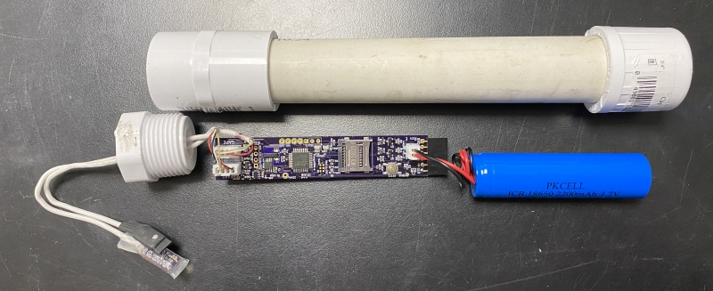

# BivalveBit

A custom data logger designed to monitor bivalve mollusc heart rate, valve
gape, and external temperature. Designed to be housed in a 3/4" schedule 40 
PVC plumbing pipe along with an 18650-size Lithium-Ion battery cell. 

Current hardware revision E (Fall 2021). See the Hardware folder for KiCad
design files.

Programmed in the Arduino environment.
 
Requires the separate BivalveBit_lib library available at: 
https://github.com/millerlp/BivalveBit_lib
 

 Based on ATmega4808 MCU using MegaCoreX board definition
 https://github.com/MCUdude/MegaCoreX
